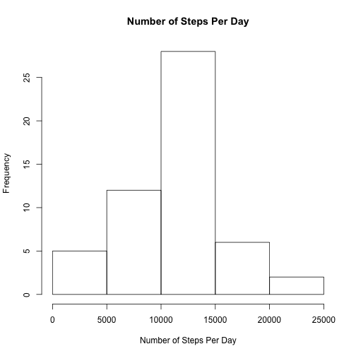
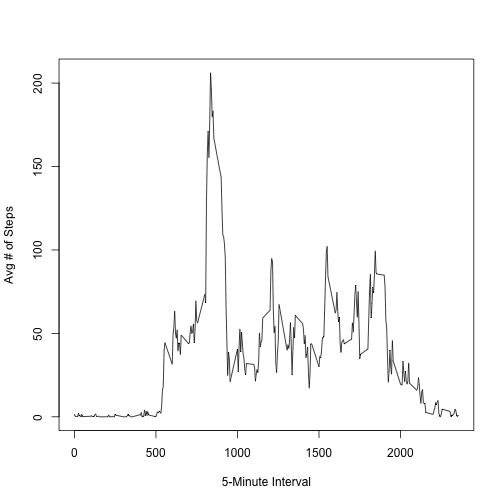
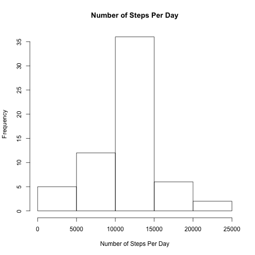
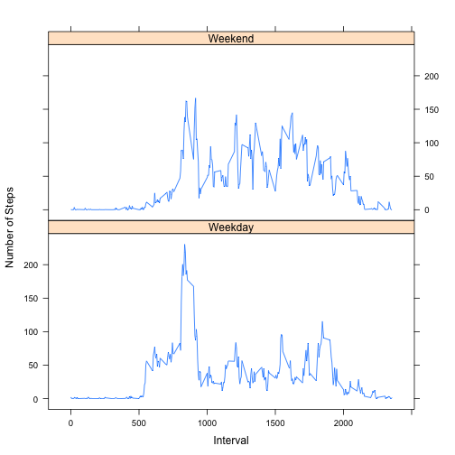

## Loading and preprocessing the data
Load and process/transform

```r
data <- read.csv(unz('activity.zip', 'activity.csv'))
rowswithdata <- data[is.na(data$steps) == FALSE,]
```


## What is mean total number of steps taken per day?
Total Number Per Day

```r
databyday <- aggregate(rowswithdata$steps, by=list(rowswithdata$date), FUN=sum)
```

Histogram

```r
hist(databyday$x, main="Number of Steps Per Day", xlab="Number of Steps Per Day")
```

 

Mean/Median Per Day

```r
mean(databyday$x)
```

```
## [1] 10766.19
```

```r
median(databyday$x)
```

```
## [1] 10765
```

## What is the average daily activity pattern?
### Avg Steps Taken every 5 minutes over time

```r
databyinterval <- aggregate(rowswithdata$steps, by=list(rowswithdata$interval), FUN=mean)
plot(databyinterval, type="l", xlab="5-Minute Interval", ylab="Avg # of Steps")
```

 

### 5-Minute Interval with most steps

```r
databyinterval[databyinterval$x == max(databyinterval$x), "Group.1"]
```

```
## [1] 835
```

## Imputing missing values
### Total Missing Values

```r
length(data[is.na(data$steps),"steps"])
```

```
## [1] 2304
```

## Strategy to impute values
### Use the mean for that interval across entire data set.

### Dataset with Imputed Values

```r
newdata <- data
for (row in 1:length(data$steps)) {
  if (is.na(data[row, 1])) {
    newdata[row,1] <- databyinterval[databyinterval$Group.1 == data[row,3], "x"]   }
}
```

### Histogram total number of steps per day

```r
newdatabyday <- aggregate(newdata$steps, by=list(newdata$date), FUN=sum)
hist(newdatabyday$x, main="Number of Steps Per Day", xlab="Number of Steps Per Day")
```

 

### Mean/median number of steps per day

```r
mean(newdatabyday$x)
```

```
## [1] 10766.19
```

```r
median(newdatabyday$x)
```

```
## [1] 10766.19
```

### Do these values differ from the estimates from the first part of the assignment?
Yes they do.

### What is the impact of imputing missing data on the estimates of the total daily number of steps?
There are more values distributed around the mean.

## Are there differences in activity patterns between weekdays and weekends?
### Add day type (weekend or weekday) to dataset

```r
newdata["Daytype"] <- sapply(as.Date(data$date), function(blah) {
  if (weekdays(blah) == "Sunday" || weekdays(blah) == "Saturday") {
    return("Weekend");
  } else {
    return("Weekday");
  }
})
```

### Avg number of steps taken in 5-minute intervals over time, by day type (see README for example)

```r
newdatabyintervalanddaytype <- aggregate(newdata$steps, by=list(newdata$interval, newdata$Daytype), FUN=mean)
library(lattice)
xyplot(newdatabyintervalanddaytype$x ~ newdatabyintervalanddaytype$Group.1 | newdatabyintervalanddaytype$Group.2, type="l", ylab="Number of Steps", xlab="Interval", layout=c(1,2))
```

 
